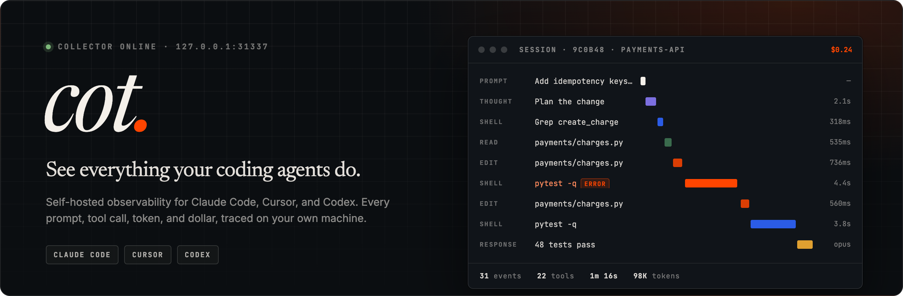
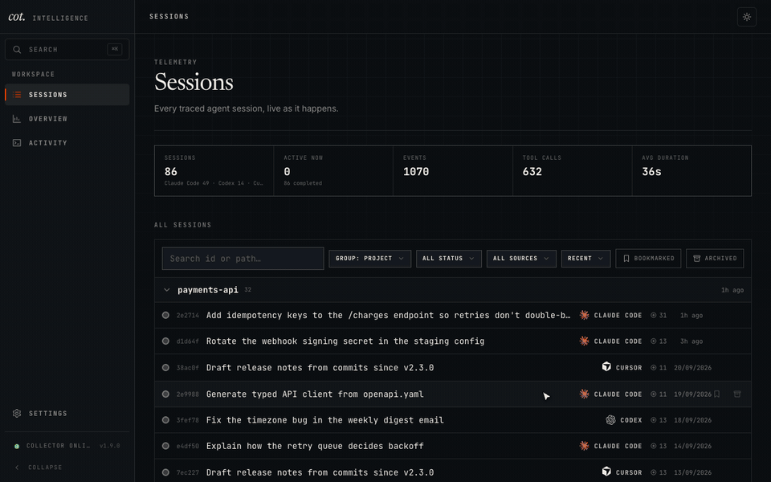
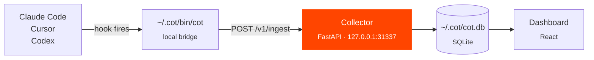

<div align="center">



<br>

**Trace agent reasoning, evaluate outcomes, and ship reliable AI on your own infrastructure.**<br>
No cloud. No accounts. Your traces stay on your machine.

<br>

[](https://github.com/cot-intelligence/cot/releases)
[](https://github.com/cot-intelligence/cot/actions/workflows/ci.yml)
[](LICENSE)
[](https://github.com/cot-intelligence/cot/pkgs/container/cot)

[**Website**](https://cot.run) · [**Quickstart**](#quickstart) · [**Features**](https://cot.run/docs/features) · [**How it works?**](https://cot.run/docs/why-cot) · [**Development**](#development)

</div>

<br>

<div align="center">
  
  <sub>Sessions → timeline → insights → overview → <kbd>⌘</kbd><kbd>K</kbd> search. Demo data; nothing here left anyone's laptop.</sub>
</div>

<br>

## Quickstart

```bash
curl -fsSL https://cot.run/install | sh
```

One command:

1. starts the collector in Docker, bound to localhost
2. installs the local bridge
3. wires up hooks for the agents you pick: **Claude Code**, **Cursor**, or **Codex**

Cot runs in the background and collects traces while you build. Open the dashboard at **[http://127.0.0.1:31337](http://127.0.0.1:31337)**.

> [!TIP]
> Already running the collector? Install just the bridge and hooks with
> `curl -fsSL http://127.0.0.1:31337/install.sh | sh`.

The default port is **31337**. If it is busy, the installer picks the next free port and saves the URL in `~/.cot/config.json`.

| Command | What it does |
| --- | --- |
| `cot up` | Start or resume the collector |
| `cot down` | Stop the collector, keeping your hooks and local data |
| `cot purge` | Remove the collector, unwire cot hooks, and delete `~/.cot` after asking |

## How it works



Agent hooks call the bridge, the bridge posts each event to the collector, and the collector normalizes its category, phase, and token counts into SQLite. If the collector is down, events queue in `~/.cot/spool.jsonl` and replay on the next contact.

## Repository

The collector API, dashboard, bridge scripts, and Docker image live in this repository.

```text
backend/app/   FastAPI collector
bridge/        Installer and cot bridge CLI
src/           React and TypeScript dashboard
```

### Development

```bash
docker compose up
```

Open [http://127.0.0.1:31337](http://127.0.0.1:31337), the same port used by the installer.

<details>
<summary><b>Frontend hot reload on the host</b></summary>

<br>

```bash
docker compose run --rm -d --name cot-api -p 127.0.0.1:31337:31337 api
npm install
COT_API_TARGET=http://127.0.0.1:31337 npm run dev
```

Vite serves on [http://localhost:4000](http://localhost:4000) and proxies API calls to the collector on port **31337**. Stop the API container with `docker rm -f cot-api` when done.

</details>

## Links

- **Website:** [cot.run](https://cot.run)
- **GitHub:** [github.com/cot-intelligence/cot](https://github.com/cot-intelligence/cot)
- **Container:** `ghcr.io/cot-intelligence/cot:latest`

## License

Cot is licensed under [AGPL-3.0](LICENSE).

<br>

<div align="center">
  <sub>Built for engineers who want to know what their agents actually did.</sub>
</div>
